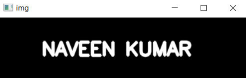
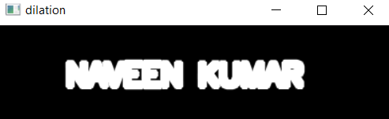

# Implementation-of-Erosion-and-Dilation
## Aim
To implement Erosion and Dilation using Python and OpenCV.
## Software Required
1. Anaconda - Python 3.7
2. OpenCV
## Algorithm:
### Step1:
Import the necessary package such as numpy and cv2

### Step2:
Create the Text using cv2.putText with font style,font thickness,and color of image.

### Step3:
Then Create the structuring element with required size and shape.

### Step4:
After setting the image,code to erode using cv2.erode() with kernel

### Step5:
Continue the program also for dilation as cv2.dilate()
 
## Program:

``` Python
# Import the necessary packages
import numpy as np
import cv2

# Create the Text using cv2.putText
font=cv2.FONT_HERSHEY_SIMPLEX
cv2.putText(img,'    NAVEEN KUMAR',(5,60),font,1,(255,0,0),3,cv2.LINE_AA)

# Create the structuring element
img=np.zeros((100,400),dtype='uint8')

# Erode the image
kernel=np.ones((5,5),np.uint8)
erosion=cv2.erode(img,kernel)
sec_img='erosion'
cv2.imshow(sec_img,erosion)
cv2.waitKey()
cv2.destroyAllWindows()

# Dilate the image
kernel=np.ones((5,5),np.uint8)
dil=cv2.dilate(img,kernel)
third_img='erosion'
cv2.imshow(third_img,dil)
cv2.waitKey()
cv2.destroyAllWindows()

```
## Output:

### Display the input Image


### Display the Eroded Image

### Display the Dilated Image


## Result
Thus the generated text image is eroded and dilated using python and OpenCV.